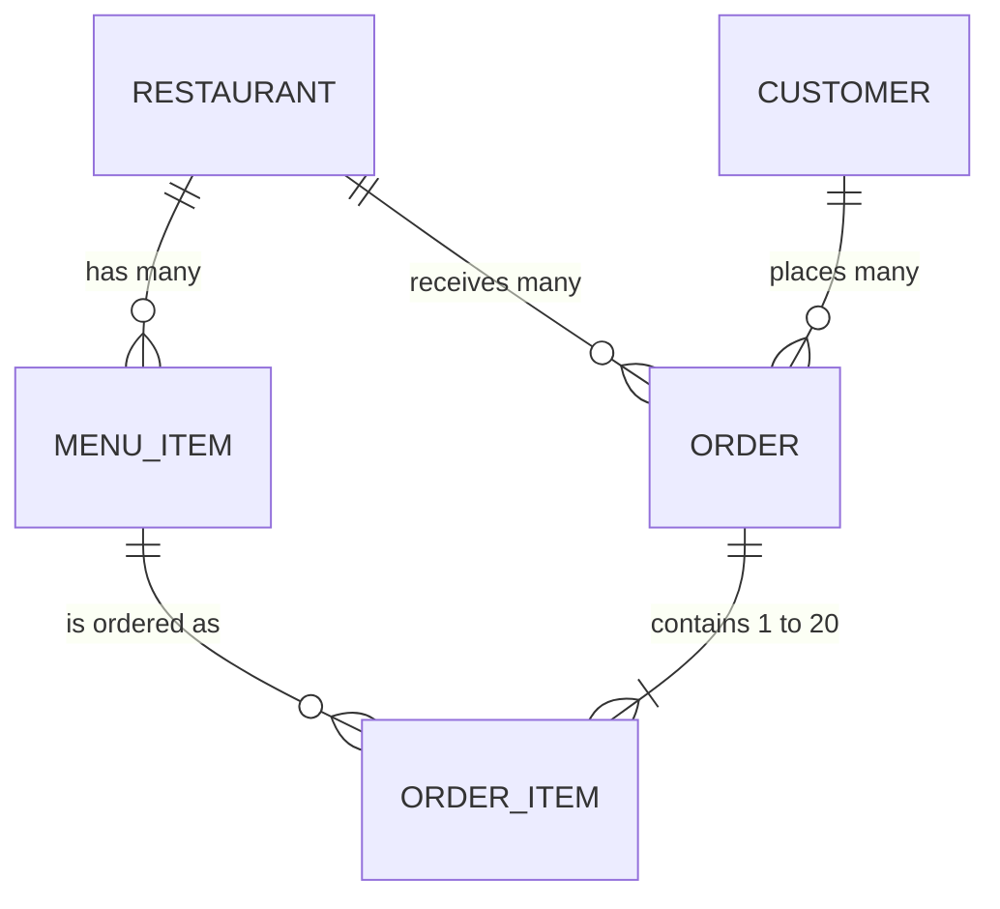

# Food Market API

A public REST API for a food delivery market: restaurants, their menus, customers and orders.

## Resource design

Written before any endpoint code.

- A **restaurant** has many **menu items**.
- A **customer** places many **orders**.
- An **order** belongs to one customer and one restaurant, and contains one or more **order items**.
- An **order item** points at one menu item and copies its name and price at the time of ordering.

Identifiers are generated strings with a type prefix (`rst_`, `itm_`, `cus_`, `ord_`, `oit_`) and 20 random characters. They are not sequential integers.

### Restaurant
| Field | Type | Required | Notes |
|---|---|---|---|
| `id` | string | generated | `rst_` + 20 characters |
| `name` | string | yes | |
| `cuisine` | string | yes | e.g. `nigerian`, `pizza`, `chinese` |
| `city` | string | yes | |
| `address` | string | yes | |
| `rating` | number | yes | 0.0 to 5.0 |
| `deliveryFeeMinor` | integer | yes | kobo |
| `currency` | string | yes | ISO code, `NGN` |
| `isOpen` | boolean | yes | |
| `createdAt`, `updatedAt` | ISO datetime | generated | |

### Menu item
| Field | Type | Required | Notes |
|---|---|---|---|
| `id` | string | generated | `itm_` + 20 characters |
| `restaurantId` | string | yes | the restaurant it belongs to |
| `name` | string | yes | |
| `description` | string | yes | |
| `category` | string | yes | `starter`, `main`, `side`, `dessert`, `drink` |
| `priceMinor` | integer | yes | kobo, greater than 0 |
| `currency` | string | yes | `NGN` |
| `isAvailable` | boolean | yes | |
| `createdAt`, `updatedAt` | ISO datetime | generated | |

### Customer
| Field | Type | Required | Notes |
|---|---|---|---|
| `id` | string | generated | `cus_` + 20 characters |
| `name` | string | yes | |
| `city` | string | yes | |
| `createdAt`, `updatedAt` | ISO datetime | generated | |

### Order
| Field | Type | Required | Notes |
|---|---|---|---|
| `id` | string | generated | `ord_` + 20 characters |
| `customerId` | string | yes | who placed it |
| `restaurantId` | string | yes | who fulfils it |
| `status` | string | generated | `pending`, `confirmed`, `preparing`, `out_for_delivery`, `delivered`, `cancelled` |
| `items` | order item[] | yes, 1 to 20 | |
| `subtotalMinor` | integer | computed | sum of item price × quantity |
| `deliveryFeeMinor` | integer | computed | the restaurant's fee when ordered |
| `totalMinor` | integer | computed | subtotal + delivery fee |
| `currency` | string | computed | `NGN` |
| `notes` | string or null | no | up to 500 characters |
| `createdAt`, `updatedAt` | ISO datetime | generated | |

### Order item (inside an order)
| Field | Type | Required | Notes |
|---|---|---|---|
| `menuItemId` | string | yes | must belong to the order's restaurant |
| `quantity` | integer | yes | 1 to 20 |
| `name` | string | copied | the menu item's name when ordered |
| `unitPriceMinor` | integer | copied | the menu item's price when ordered |
