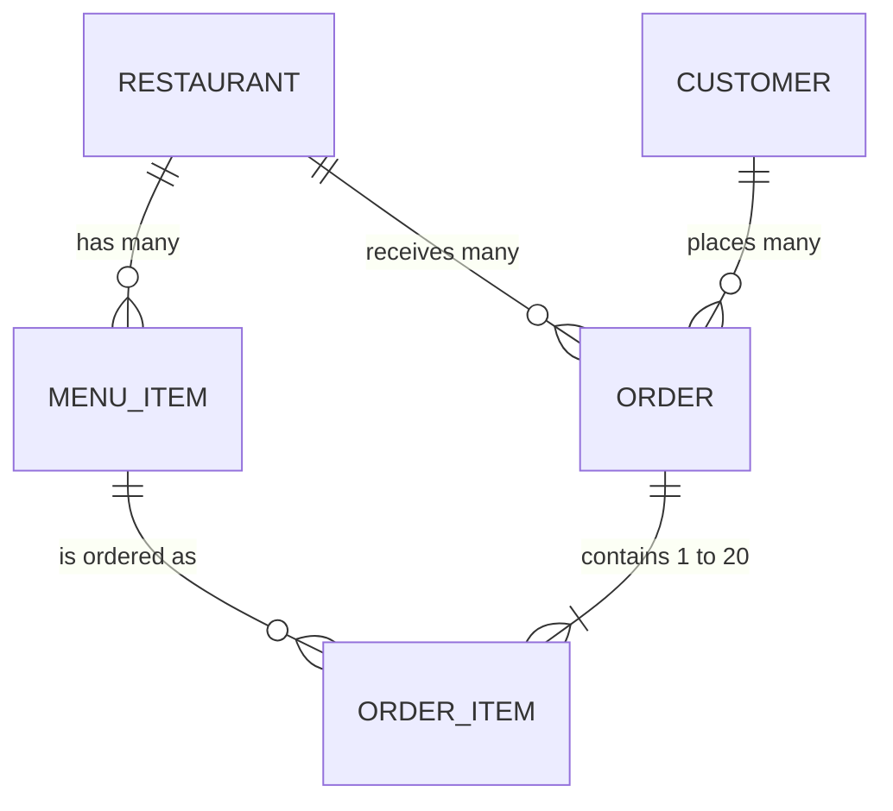

# Food Market API

A public REST API for a food delivery market: restaurants, their menus, customers and orders.

## Resource design

Written before any endpoint code.



- A **restaurant** has many **menu items**.
- A **customer** places many **orders**.
- An **order** belongs to one customer and one restaurant, and contains one or more **order items**.
- An **order item** points at one menu item and copies its name and price at the time of ordering.

Identifiers are generated strings with a type prefix (`rst_`, `itm_`, `cus_`, `ord_`, `oit_`) and 20 random characters. They are not sequential integers.

### Restaurant
| Field | Type | Required | Notes |
|---|---|---|---|
| `id` | string | generated | `rst_` + 20 characters |
| `name` | string | yes | |
| `cuisine` | string | yes | e.g. `nigerian`, `pizza`, `chinese` |
| `city` | string | yes | |
| `address` | string | yes | |
| `rating` | number | yes | 0.0 to 5.0 |
| `deliveryFeeMinor` | integer | yes | kobo |
| `currency` | string | yes | ISO code, `NGN` |
| `isOpen` | boolean | yes | |
| `createdAt`, `updatedAt` | ISO datetime | generated | |

### Menu item
| Field | Type | Required | Notes |
|---|---|---|---|
| `id` | string | generated | `itm_` + 20 characters |
| `restaurantId` | string | yes | the restaurant it belongs to |
| `name` | string | yes | |
| `description` | string | yes | |
| `category` | string | yes | `starter`, `main`, `side`, `dessert`, `drink` |
| `priceMinor` | integer | yes | kobo, greater than 0 |
| `currency` | string | yes | `NGN` |
| `isAvailable` | boolean | yes | |
| `createdAt`, `updatedAt` | ISO datetime | generated | |

### Customer
| Field | Type | Required | Notes |
|---|---|---|---|
| `id` | string | generated | `cus_` + 20 characters |
| `name` | string | yes | |
| `city` | string | yes | |
| `createdAt`, `updatedAt` | ISO datetime | generated | |

### Order
| Field | Type | Required | Notes |
|---|---|---|---|
| `id` | string | generated | `ord_` + 20 characters |
| `customerId` | string | yes | who placed it |
| `restaurantId` | string | yes | who fulfils it |
| `status` | string | generated | `pending`, `confirmed`, `preparing`, `out_for_delivery`, `delivered`, `cancelled` |
| `items` | order item[] | yes, 1 to 20 | |
| `subtotalMinor` | integer | computed | sum of item price × quantity |
| `deliveryFeeMinor` | integer | computed | the restaurant's fee when ordered |
| `totalMinor` | integer | computed | subtotal + delivery fee |
| `currency` | string | computed | `NGN` |
| `notes` | string or null | no | up to 500 characters |
| `createdAt`, `updatedAt` | ISO datetime | generated | |

### Order item (inside an order)
| Field | Type | Required | Notes |
|---|---|---|---|
| `menuItemId` | string | yes | must belong to the order's restaurant |
| `quantity` | integer | yes | 1 to 20 |
| `name` | string | copied | the menu item's name when ordered |
| `unitPriceMinor` | integer | copied | the menu item's price when ordered |

---

## Live API

**Base URL:** `https://food-market-api.vercel.app/api/v1`

Paste this into a terminal:

```bash
curl "https://food-market-api.vercel.app/api/v1/restaurants?cuisine=pizza&minRating=4.5&sort=rating&order=desc&limit=2"
```

A small page that consumes the live API: `https://food-market-api.vercel.app/consumer.html`

No key and no sign-up are needed. Reads are open to anyone.

## Conventions

These hold for every endpoint, so they are stated once.

**Versioning.** Every path starts with `/api/v1`. A change that would break a client will go to `/api/v2`, and `v1` will keep working.

**Success envelope.** One item: `{ "data": {...} }`. A list: `{ "data": [...], "meta": {...} }`.

**Error envelope.** Always this shape, always with a matching HTTP status. `fields` is present when specific inputs are at fault.

```json
{ "error": { "code": "INVALID_QUERY", "message": "One or more query parameters are invalid.", "fields": { "offset": "offset must be 0 or greater." } } }
```

| Status | Code | When |
|---|---|---|
| 400 | `INVALID_QUERY` | A query parameter is unknown, malformed or out of range. |
| 400 | `INVALID_CURSOR` | The cursor does not match any record. |
| 400 | `INVALID_JSON` | The request body is not JSON. |
| 404 | `NOT_FOUND` | No resource has that id, the id is malformed, or the path does not exist. |
| 409 | `INVALID_TRANSITION`, `ORDER_IN_PROGRESS`, `CONFLICT` | The request is valid but not allowed in the resource's current state. |
| 422 | `VALIDATION_FAILED` | The body is JSON but breaks a rule. `fields` names each one. |
| 429 | `RATE_LIMITED` | Too many requests from your IP address. See `Retry-After`. |
| 500 | `INTERNAL_ERROR` | Our fault. No detail is leaked. |

**Money.** Whole numbers in minor units (kobo) with a `currency` beside them. `240000` with `NGN` is ₦2,400.00.

**Dates.** ISO 8601 in UTC.

**CORS.** Open (`Access-Control-Allow-Origin: *`), so the API can be called from a browser on any site.

### List parameters

Every list endpoint accepts these, in addition to its own filters.

| Parameter | Type | Default | Notes |
|---|---|---|---|
| `limit` | integer ≥ 1 | `20` | Values above `100` are clamped to `100`. `0`, negatives and non-numbers are 400. |
| `cursor` | string | none | The `meta.nextCursor` from the previous response. Returns the items after it. |
| `offset` | integer ≥ 0 | `0` | Skip this many items. Cannot be combined with `cursor`. Negative is 400. |
| `sort` | string | per endpoint | One of the endpoint's sortable fields. Anything else is 400. |
| `order` | `asc` or `desc` | `asc` when `sort` is given | |

Unknown parameters are refused with 400, not ignored, so a misspelt filter never silently returns everything.

Every list response carries:

```json
"meta": { "total": 200, "limit": 20, "offset": 0, "hasMore": true, "nextCursor": "rst_2lvbces522wlho04k9h5" }
```

- `total`: how many items match the filters, across all pages.
- `hasMore`: whether another page exists.
- `nextCursor`: pass it as `cursor` to get the next page; `null` on the last page.
- `offset`: the offset used, or `null` when paging by cursor.

**Paging through everything:** request the first page, then repeat with `cursor=<nextCursor>` and the same filters and sort until `hasMore` is `false`. A cursor belongs to the filters and sort it was issued with.

**Asking beyond the end** (for example `offset=5000` on 200 items) is not an error: it returns `"data": []` with `"hasMore": false`.

### Rate limits

| Requests | Limit | Scope |
|---|---|---|
| `GET` | 100 per minute | per IP address |
| `POST`, `PATCH`, `DELETE` | 20 per minute | per IP address |

Every response includes `X-RateLimit-Limit` and `X-RateLimit-Remaining`. Over the limit you get `429` with a `Retry-After` header in seconds:

```
HTTP/1.1 429 Too Many Requests
Retry-After: 60

{"error":{"code":"RATE_LIMITED","message":"Too many requests. Try again in 60 seconds."}}
```

The numbers live in [`src/config.ts`](src/config.ts).

## Endpoints

| Method | Path | Purpose |
|---|---|---|
| GET | `/api/v1` | Index of resources and limits |
| GET | `/api/v1/restaurants` | List restaurants |
| GET | `/api/v1/restaurants/:id` | One restaurant |
| GET | `/api/v1/restaurants/:id/menu` | A restaurant's menu items (nested) |
| GET | `/api/v1/menu-items` | List menu items across all restaurants |
| GET | `/api/v1/menu-items/:id` | One menu item |
| GET | `/api/v1/customers` | List customers |
| GET | `/api/v1/customers/:id` | One customer |
| GET | `/api/v1/orders` | List orders |
| POST | `/api/v1/orders` | Create an order |
| GET | `/api/v1/orders/:id` | One order |
| PATCH | `/api/v1/orders/:id` | Change an order's status or notes |
| DELETE | `/api/v1/orders/:id` | Remove an order |

In the examples, `$API` is `https://food-market-api.vercel.app/api/v1`.

### GET /restaurants

| Parameter | Type | Default | Notes |
|---|---|---|---|
| `cuisine` | string | none | `nigerian`, `grill`, `pizza`, `burgers`, `chinese`, `indian`, `seafood`, `shawarma`, `vegan`, `bakery` |
| `city` | string | none | Case-insensitive exact match, e.g. `Lagos` |
| `minRating` | number 0 to 5 | none | Rating at or above this |
| `isOpen` | `true` or `false` | none | |
| `sort` | `name`, `rating`, `deliveryFeeMinor`, `createdAt` | `name` | |

```bash
curl "$API/restaurants?cuisine=pizza&minRating=4.5&sort=rating&order=desc&limit=2"
```
```json
{
  "data": [
    {
      "id": "rst_3f0cyvvnhmx6ql6wfcpg",
      "name": "Reese's Oven",
      "cuisine": "pizza",
      "city": "Ibadan",
      "address": "168 Fadel Street",
      "rating": 4.9,
      "deliveryFeeMinor": 160000,
      "currency": "NGN",
      "isOpen": true,
      "createdAt": "2025-08-31T17:40:00.000Z",
      "updatedAt": "2026-10-01T12:00:00.000Z"
    },
    {
      "id": "rst_2lvbces522wlho04k9h5",
      "name": "Lambert's Oven",
      "cuisine": "pizza",
      "city": "Enugu",
      "address": "149 Erdman Street",
      "rating": 4.7,
      "deliveryFeeMinor": 180000,
      "currency": "NGN",
      "isOpen": true,
      "createdAt": "2025-08-11T08:56:00.000Z",
      "updatedAt": "2026-10-01T12:00:00.000Z"
    }
  ],
  "meta": { "total": 4, "limit": 2, "offset": 0, "hasMore": true, "nextCursor": "rst_2lvbces522wlho04k9h5" }
}
```

The next page:

```bash
curl "$API/restaurants?cuisine=pizza&minRating=4.5&sort=rating&order=desc&limit=2&cursor=rst_2lvbces522wlho04k9h5"
```

### GET /restaurants/:id

```bash
curl "$API/restaurants/rst_w758xwc23w720jise2gf"
```
```json
{
  "data": {
    "id": "rst_w758xwc23w720jise2gf",
    "name": "Abigayle's Canteen",
    "cuisine": "nigerian",
    "city": "Abuja",
    "address": "18 Price Street",
    "rating": 4.1,
    "deliveryFeeMinor": 85000,
    "currency": "NGN",
    "isOpen": true,
    "createdAt": "2025-04-13T02:12:00.000Z",
    "updatedAt": "2026-10-01T12:00:00.000Z"
  }
}
```

Errors: `404 NOT_FOUND` for an unknown or malformed id.

```bash
curl "$API/restaurants/12345"
```
```json
{ "error": { "code": "NOT_FOUND", "message": "Restaurant not found" } }
```

### GET /restaurants/:id/menu

The menu items of one restaurant. `404` if the restaurant does not exist.

| Parameter | Type | Default | Notes |
|---|---|---|---|
| `category` | `starter`, `main`, `side`, `dessert`, `drink` | none | |
| `minPrice` | integer ≥ 0 | none | In kobo |
| `maxPrice` | integer ≥ 0 | none | In kobo |
| `isAvailable` | `true` or `false` | none | |
| `sort` | `name`, `priceMinor`, `createdAt` | `name` | |

```bash
curl "$API/restaurants/rst_w758xwc23w720jise2gf/menu?category=main&isAvailable=true&sort=priceMinor&limit=2"
```
```json
{
  "data": [
    {
      "id": "itm_yk4en5hfb2he2rcrkv1s",
      "restaurantId": "rst_w758xwc23w720jise2gf",
      "name": "Egusi Soup with Pounded Yam",
      "description": "Egusi Soup with Pounded Yam, cooked the traditional way.",
      "category": "main",
      "priceMinor": 240000,
      "currency": "NGN",
      "isAvailable": true,
      "createdAt": "2025-04-13T02:12:00.000Z",
      "updatedAt": "2026-10-01T12:00:00.000Z"
    },
    {
      "id": "itm_c6emhu9d8wrf8b444l9h",
      "restaurantId": "rst_w758xwc23w720jise2gf",
      "name": "Okra Soup with Eba",
      "description": "Okra Soup with Eba, our best seller.",
      "category": "main",
      "priceMinor": 260000,
      "currency": "NGN",
      "isAvailable": true,
      "createdAt": "2025-04-13T02:12:00.000Z",
      "updatedAt": "2026-10-01T12:00:00.000Z"
    }
  ],
  "meta": { "total": 6, "limit": 2, "offset": 0, "hasMore": true, "nextCursor": "itm_c6emhu9d8wrf8b444l9h" }
}
```

### GET /menu-items

Menu items across all restaurants. Same parameters as the nested menu, plus:

| Parameter | Type | Default | Notes |
|---|---|---|---|
| `restaurantId` | string | none | Only this restaurant's items |

```bash
curl "$API/menu-items?category=drink&maxPrice=100000&sort=priceMinor&order=asc&limit=5"
```

The response has the same shape as the nested menu above.

### GET /menu-items/:id

```bash
curl "$API/menu-items/itm_yk4en5hfb2he2rcrkv1s"
```

Returns `{ "data": { ...one menu item... } }`. Errors: `404 NOT_FOUND`.

### GET /customers

| Parameter | Type | Default | Notes |
|---|---|---|---|
| `city` | string | none | Case-insensitive exact match |
| `joinedAfter` | ISO date | none | Created at or after, e.g. `2026-01-01` |
| `joinedBefore` | ISO date | none | Created at or before |
| `sort` | `name`, `createdAt` | `name` | |

```bash
curl "$API/customers?city=Lagos&joinedAfter=2025-06-01&limit=1"
```
```json
{
  "data": [
    { "id": "cus_uy1pycy4adj8pp53rg13", "name": "Asa Tremblay", "city": "Lagos", "createdAt": "2025-08-12T15:26:00.000Z", "updatedAt": "2026-10-01T12:00:00.000Z" }
  ],
  "meta": { "total": 41, "limit": 1, "offset": 0, "hasMore": true, "nextCursor": "cus_uy1pycy4adj8pp53rg13" }
}
```

### GET /customers/:id

```bash
curl "$API/customers/cus_uy1pycy4adj8pp53rg13"
```

Returns `{ "data": { ...one customer... } }`. Errors: `404 NOT_FOUND`.

### GET /orders

| Parameter | Type | Default | Notes |
|---|---|---|---|
| `status` | `pending`, `confirmed`, `preparing`, `out_for_delivery`, `delivered`, `cancelled` | none | |
| `restaurantId` | string | none | |
| `customerId` | string | none | |
| `minTotal` | integer ≥ 0 | none | `totalMinor` at or above, in kobo |
| `maxTotal` | integer ≥ 0 | none | `totalMinor` at or below, in kobo |
| `sort` | `createdAt`, `totalMinor` | `createdAt`, newest first | |

```bash
curl "$API/orders?status=delivered&minTotal=1500000&sort=totalMinor&order=desc&limit=1"
```

Returns `{ "data": [ ...orders... ], "meta": {...} }`, each order in the shape shown under POST below.

### POST /orders

Body (JSON):

| Field | Type | Required | Notes |
|---|---|---|---|
| `customerId` | string | yes | An existing customer |
| `restaurantId` | string | yes | An existing, open restaurant |
| `items` | array, 1 to 20 | yes | |
| `items[].menuItemId` | string | yes | Must belong to that restaurant and be available. No repeats: use `quantity`. |
| `items[].quantity` | integer 1 to 20 | yes | |
| `notes` | string, up to 500 characters | no | |

Prices are taken from the menu on the server. A price sent by the client is rejected as an unknown field.

```bash
curl -X POST "$API/orders" \
  -H "Content-Type: application/json" \
  -d '{
    "customerId": "cus_gd49gaxmamnz87idw990",
    "restaurantId": "rst_w758xwc23w720jise2gf",
    "items": [
      { "menuItemId": "itm_yk4en5hfb2he2rcrkv1s", "quantity": 2 },
      { "menuItemId": "itm_c6emhu9d8wrf8b444l9h", "quantity": 1 }
    ],
    "notes": "Call on arrival"
  }'
```

`201 Created`:
```json
{
  "data": {
    "id": "ord_7pq4l0yz8iupz72mzrbf",
    "customerId": "cus_gd49gaxmamnz87idw990",
    "restaurantId": "rst_w758xwc23w720jise2gf",
    "status": "pending",
    "items": [
      { "menuItemId": "itm_yk4en5hfb2he2rcrkv1s", "name": "Egusi Soup with Pounded Yam", "unitPriceMinor": 240000, "quantity": 2 },
      { "menuItemId": "itm_c6emhu9d8wrf8b444l9h", "name": "Okra Soup with Eba", "unitPriceMinor": 260000, "quantity": 1 }
    ],
    "subtotalMinor": 740000,
    "deliveryFeeMinor": 85000,
    "totalMinor": 825000,
    "currency": "NGN",
    "notes": "Call on arrival",
    "createdAt": "2026-10-07T06:34:58.727Z",
    "updatedAt": "2026-10-07T06:34:58.727Z"
  }
}
```

Errors: `400 INVALID_JSON`; `422 VALIDATION_FAILED` with the field named, for example:

```bash
curl -X POST "$API/orders" -H "Content-Type: application/json" -d '{"customerId":"cus_x"}'
```
```json
{
  "error": {
    "code": "VALIDATION_FAILED",
    "message": "The request body is invalid.",
    "fields": {
      "customerId": "customerId is not a valid customer id.",
      "restaurantId": "restaurantId is required.",
      "items": "items is required."
    }
  }
}
```

Item-level problems are named by position, e.g. `"items.0.menuItemId": "This menu item belongs to a different restaurant."`

### GET /orders/:id

```bash
curl "$API/orders/ord_7pq4l0yz8iupz72mzrbf"
```

Returns `{ "data": { ...one order... } }`. Errors: `404 NOT_FOUND`.

### PATCH /orders/:id

Partial update. Send `status`, `notes`, or both.

| Field | Type | Notes |
|---|---|---|
| `status` | string | Must be an allowed next step (below) |
| `notes` | string or `null` | Up to 500 characters; `null` clears it |

Allowed status changes: `pending` → `confirmed` or `cancelled`; `confirmed` → `preparing` or `cancelled`; `preparing` → `out_for_delivery` or `cancelled`; `out_for_delivery` → `delivered`. `delivered` and `cancelled` are final.

```bash
curl -X PATCH "$API/orders/ord_7pq4l0yz8iupz72mzrbf" -H "Content-Type: application/json" -d '{"status":"confirmed"}'
```

Returns `200` with the updated order. Errors: `404 NOT_FOUND`; `422 VALIDATION_FAILED` (unknown status, empty body); `409 INVALID_TRANSITION`:

```json
{ "error": { "code": "INVALID_TRANSITION", "message": "An order that is pending cannot become delivered. Allowed: confirmed, cancelled." } }
```

### DELETE /orders/:id

Removes an order that is `pending` or `cancelled`.

```bash
curl -X DELETE "$API/orders/ord_7pq4l0yz8iupz72mzrbf"
```
```json
{ "data": { "id": "ord_7pq4l0yz8iupz72mzrbf", "deleted": true } }
```

Errors: `404 NOT_FOUND`; `409 ORDER_IN_PROGRESS` for an order that is being prepared, on its way, or delivered.

## Design decisions

**Why these resources.** A food market has the relationships the brief asks for without inventing any: a one-to-many that reads naturally as a nested route (a restaurant's menu), a resource with two parents (an order belongs to a customer and a restaurant), and a many-to-many (orders and menu items) that needs a join row with data of its own. Orders are the one writable resource because they are the only thing a member of the public would create; restaurants and menus are reference data loaded by the seed. The alternative was making everything writable, which would have meant four more sets of validation rules on an API with no authentication.

**Why generated identifiers.** A sequential integer lets anyone enumerate the dataset by counting (`/orders/1`, `/orders/2`, …) and reveals volume: order number 5,000 says how much business has been done. Identifiers here are a type prefix plus 20 random characters. The prefix (`rst_`, `ord_`) means an id pasted into the wrong parameter is recognisable at a glance and is rejected by shape before any query runs. The alternative was UUIDs, which are equally unguessable but longer and carry no type.

**Why cursor pagination, with offset kept as an option.** The cursor is the default way to page, and `meta.nextCursor` is in every list response.

| | Cursor | Offset |
|---|---|---|
| How it works | "Give me the items after this one", using the last item's id in the current sort order | "Skip N rows, then give me the next ones" |
| Cost of a deep page | The same as the first page: the database seeks to the row | Grows with depth: the database reads and discards the N skipped rows |
| If rows are added or removed while paging | Stable: no item is skipped or repeated | Items shift: a new order pushes one onto the next page (seen twice), a deletion pulls one back (never seen) |
| Jump to an arbitrary page | Not possible | Possible |
| Best for | "Load more", syncing, exporting, feeds that change | Small, stable lists with numbered pages |

Orders change constantly, so walking them by offset can miss or duplicate records, which matters to anyone syncing them. That is the case for cursors. Offset is kept because a numbered-page interface over restaurants, which barely change, is a reasonable thing to build and costs nothing to support here. With a few hundred rows either is fast; the difference is correctness under change, and later, speed at depth.

**The envelope, and why.** Every success is `{ data, meta? }` and every failure is `{ error: { code, message, fields? } }`. `data` is always where the payload is, whether one item or many, so a client writes one unwrapping function. `meta` leaves room to add information about a response (as pagination does) without changing what `data` is. Errors carry a stable machine-readable `code` for programs and a `message` for people, and the HTTP status always agrees with the body: there is no `200` with an error inside. The alternative was returning bare arrays and objects, which is shorter but leaves nowhere to put the total count or the next cursor without breaking every client.

**Other decisions**
- **Unknown query parameters are a 400.** Ignoring `?cusine=pizza` would return every restaurant and look like success.
- **An oversized `limit` is clamped, not refused.** Asking for too much is not a mistake worth failing over; the response's `meta.limit` says what was applied.
- **A malformed id is 404, not 400.** From the client's side there is no such resource either way, and the check happens before any database query, so it can never be a 500.
- **Rate limit counters live in Postgres,** not in memory, because on serverless hosting consecutive requests land on different instances and an in-memory counter would never reach the limit.

## Adding a field without breaking clients

Adding is safe; changing or removing is not. To add, say, `phone` to restaurants: add a nullable column (or one with a default) in a new migration, so existing rows are valid; return it in responses. Existing clients ignore a field they do not know. Nothing about `v1` changes. Renaming a field, changing its type, making an optional input required, or removing a field would break clients, and those go to `/api/v2`.

## Running it locally

Requires Node.js 20.12 or newer and PostgreSQL.

```bash
git clone https://github.com/daisydev11/food-market-api.git
cd food-market-api
npm install
cp .env.example .env          # then put your database URL in .env by hand
npx prisma migrate deploy     # create the tables
npm run seed                  # 200 restaurants, 2,930 menu items, 300 customers, 500 orders
npm run dev                   # http://localhost:3000/api/v1
```

`npm run seed` is repeatable. Faker runs with a fixed seed, so every run generates the same records with the same ids, and inserts skip rows that already exist. A second run reports `inserted 0` for every table.

Tests: `npm test`.

## Deploying (Vercel + Neon)

1. Import this repository at vercel.com.
2. In the project's **Storage** tab, create a Neon Postgres database and connect it to the project. Vercel sets `DATABASE_URL` (and `DATABASE_URL_UNPOOLED`) itself, so the connection string is never copied by hand.
3. Deploy. The build command in `vercel.json` runs `scripts/vercel-build.mjs`, which applies the migrations, runs the seed, then builds. The seed is repeatable, so every later deploy inserts nothing.
4. Check it from outside: `curl https://food-market-api.vercel.app/api/v1/restaurants?limit=2`

Migrating and seeding inside the build means a deployment cannot go live with an empty database, which is one of the traps this task warns about. The alternative, running both by hand against production from a laptop, works but is a step someone forgets.

## Evidence

- **Live API URL:** `https://food-market-api.vercel.app/api/v1`
- **Seed script:** [`prisma/seed.mjs`](prisma/seed.mjs)
- **curl against the live URL, paginated response:** `evidence/curl-paginated.png`
- **The 429 after exceeding the rate limit:** `evidence/rate-limit-429.png`
- **The consumer showing data from the live API:** `evidence/consumer-live.png`

## What went wrong on the first deployment

- **The build failed with `DATABASE_URL is not set`.** The database client reads its URL when the module loads, and the first deploy had no database attached. Attaching Neon through Vercel's Storage tab fixed it, and the build script now stops with a clear message if the variable is missing.
- **Every endpoint returned 500 once it did build.** The error was `ENOENT ... query_compiler_bg.wasm`. Prisma's engine-free client reads a `.wasm` file at run time, Next.js could not see that read when deciding which files a serverless function needs, and so the file was left out. It never showed locally because `node_modules` is all there on a laptop. Fixed by naming the file in `outputFileTracingIncludes` in `next.config.ts`.
- **Migrations and the seed now run inside the Vercel build** (`scripts/vercel-build.mjs`), so the live API cannot be deployed empty.

## What this does not do

- No authentication. Reads are meant to be public; the order write endpoints are open too, protected only by validation and a tighter rate limit. A real deployment would require an API key for writes.
- The rate limit is a fixed window per IP address: a client can send up to twice the limit across a window boundary, and clients behind one shared address share an allowance.
- `total` is counted on every list request. On very large tables that count becomes the slowest part and would be dropped or estimated.
- Filters are exact matches and ranges. There is no text search.
